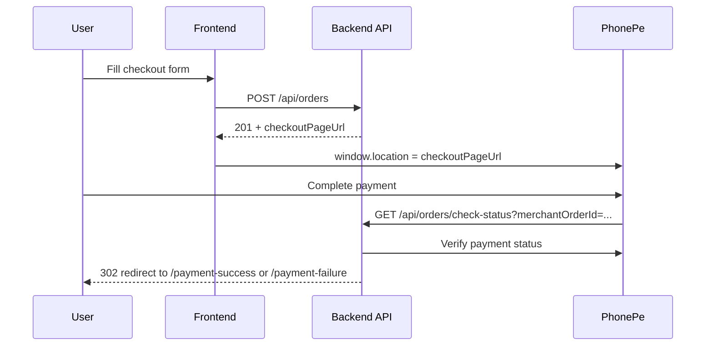

# Frontend Payment Integration — Nimmaaishwini Checkout

**Status:** Ready for frontend integration  
**Payment provider:** PhonePe (Standard Checkout)  
**Related:** [CART_SCHEMA.md](./CART_SCHEMA.md), [ORDER_CHECKOUT_SCHEMA.md](./ORDER_CHECKOUT_SCHEMA.md), [PAYMENT_RETRY_SCHEMA.md](./PAYMENT_RETRY_SCHEMA.md)

---

## Overview

Checkout is a **2-step flow**:

1. Frontend calls **POST `/api/orders`** with cart + customer details.
2. Backend creates the order, starts PhonePe payment, and returns **`checkoutPageUrl`**.
3. Frontend redirects the user to **`checkoutPageUrl`** (PhonePe hosted payment page).
4. After payment, PhonePe redirects to the backend callback.
5. Backend verifies payment and redirects the user to your frontend:
   - **Success:** `/payment-success?merchantOrderId={orderId}`
   - **Failure:** `/payment-failure?merchantOrderId={orderId}`

The frontend does **not** call PhonePe directly. It only needs to:

- Submit the order
- Redirect to `checkoutPageUrl`
- Build success/failure pages that read `merchantOrderId` from the URL

---

## Flow diagram



---

## Base URL

| Environment | API base URL |
|-------------|--------------|
| Local (serverless offline) | `http://localhost:3000` |
| Dev / Prod | Your deployed API Gateway URL |

All endpoints below are relative to this base URL.

---

## 1. Place order & start payment

### `POST /api/orders`

**Auth:** Not required (guest checkout, India only)

### Request headers

```http
Content-Type: application/json
```

### Request body

Same as before — no payment fields needed from frontend.

```json
{
  "customer": {
    "name": "Priya Sharma",
    "contactNumber": "+91 98765 43210",
    "alternateNumber": "",
    "address": "42, Temple Road, Jayanagar 4th Block",
    "landmark": "Near Nimma Ashwini Store",
    "pincode": "560041",
    "city": "Bengaluru",
    "state": "Karnataka",
    "country": "India"
  },
  "items": [
    {
      "productId": "6a475c66b203bc97e100aaa1",
      "slug": "herbal-hair-oil",
      "name": "Herbal Hair Oil",
      "variantId": "250ml",
      "variantLabel": "250 ml",
      "quantity": 1,
      "unitPrice": 750,
      "lineTotal": 750
    }
  ],
  "subtotal": 750,
  "currency": "INR",
  "orderType": "domestic"
}
```

### Validation rules (unchanged)

| Field | Rule |
|-------|------|
| `customer.country` | Must be `"India"` |
| `orderType` | Must be `"domestic"` |
| `customer.pincode` | 6-digit Indian pincode |
| `customer.contactNumber` | 10–15 digits, optional `+` prefix |
| `items` | At least 1 item |
| `subtotal` | Must match sum of `lineTotal` (backend re-validates) |

### Success response — `201 Created`

```json
{
  "success": true,
  "message": "Order placed successfully. Complete payment to confirm.",
  "data": {
    "id": "6a476abc123def4567890123",
    "orderNumber": "NA-2026-00042",
    "status": "pending",
    "paymentStatus": "initiated",
    "customer": {
      "name": "Priya Sharma",
      "contactNumber": "+91 98765 43210",
      "alternateNumber": "",
      "address": "42, Temple Road, Jayanagar 4th Block",
      "landmark": "Near Nimma Ashwini Store",
      "pincode": "560041",
      "city": "Bengaluru",
      "state": "Karnataka",
      "country": "India"
    },
    "items": [
      {
        "productId": "6a475c66b203bc97e100aaa1",
        "slug": "herbal-hair-oil",
        "name": "Herbal Hair Oil",
        "variantId": "250ml",
        "variantLabel": "250 ml",
        "quantity": 1,
        "unitPrice": 750,
        "lineTotal": 750
      }
    ],
    "subtotal": 750,
    "currency": "INR",
    "orderType": "domestic",
    "createdAt": "2026-07-03T10:15:00.000Z",
    "updatedAt": "2026-07-03T10:15:00.000Z",
    "checkoutPageUrl": "https://mercury-uat.phonepe.com/..."
  }
}
```

### Frontend action on success

```javascript
const response = await fetch(`${API_BASE_URL}/api/orders`, {
  method: 'POST',
  headers: { 'Content-Type': 'application/json' },
  body: JSON.stringify(checkoutPayload),
});

const result = await response.json();

if (!response.ok || !result.success) {
  // Handle validation / stock / payment initiation errors
  throw new Error(result.message);
}

// Save order id locally if needed (optional)
const orderId = result.data.id;
const orderNumber = result.data.orderNumber;

// Redirect user to PhonePe checkout
window.location.href = result.data.checkoutPageUrl;
```

> **Important:** Do not show an "order confirmed" message before payment.  
> Order is only confirmed after successful payment (`status` becomes `confirmed`).

### Error responses

| HTTP | When |
|------|------|
| `400` | Validation failed (field-level `errors` object) |
| `404` | Product or variant not found |
| `409` | Insufficient stock |
| `422` | Non-India order |
| `502` | PhonePe payment session could not be started |

**Example — validation error (`400`):**

```json
{
  "success": false,
  "message": "Order validation failed",
  "errors": {
    "items.0.unitPrice": "Price has changed. Please refresh your cart"
  }
}
```

**Example — payment initiation failed (`502`):**

```json
{
  "success": false,
  "message": "Failed to initiate payment"
}
```

---

## 2. Payment callback (backend-handled)

### `GET /api/orders/check-status?merchantOrderId={orderId}`

**Called by:** PhonePe (not the frontend directly)

After the user pays on PhonePe, PhonePe redirects the browser to this backend URL. The backend:

1. Verifies payment with PhonePe
2. Updates the order in the database
3. Redirects (`302`) the browser to the frontend

### Redirect targets

| Payment result | Redirect URL |
|----------------|--------------|
| Success | `{FRONTEND_URL}/payment-success?merchantOrderId={orderId}` |
| Failure / cancelled | `{FRONTEND_URL}/payment-failure?merchantOrderId={orderId}` |

`FRONTEND_URL` is configured on the backend (e.g. `https://www.nimmaaishwini.com`).

---

## 3. Frontend pages to build

### `/payment-success`

PhonePe redirects here after successful payment.

**Query params:**

| Param | Type | Description |
|-------|------|-------------|
| `merchantOrderId` | string | Order MongoDB `_id` (same as `data.id` from place-order response) |

**Suggested UI:**

- Show "Payment successful" / "Order confirmed"
- Display `merchantOrderId` or fetch order details later (when order detail API is available)
- Clear cart from local storage
- Link back to home / shop

**Example (React):**

```javascript
import { useSearchParams } from 'react-router-dom';

export function PaymentSuccessPage() {
  const [params] = useSearchParams();
  const merchantOrderId = params.get('merchantOrderId');

  return (
    <div>
      <h1>Payment successful</h1>
      <p>Your order has been placed.</p>
      {merchantOrderId && <p>Reference: {merchantOrderId}</p>}
    </div>
  );
}
```

### `/payment-failure`

PhonePe redirects here when payment fails or is cancelled.

**Query params:** Same as success — `merchantOrderId`

**Suggested UI:**

- Show "Payment failed" or "Payment cancelled"
- Offer **Try again** → `POST /api/orders/retry-payment` with `merchantOrderId` → redirect to new `checkoutPageUrl` (same order; do **not** create a new order). Full contract: [PAYMENT_RETRY_SCHEMA.md](./PAYMENT_RETRY_SCHEMA.md)
- If no `merchantOrderId` or retry fails → link to `/checkout` / cart + support contact

---

## Status values

### Order `status`

| Value | Meaning |
|-------|---------|
| `pending` | Order created, payment not completed yet |
| `confirmed` | Payment completed successfully |
| `shipped` | Order shipped (future) |
| `delivered` | Order delivered (future) |
| `cancelled` | Order cancelled (future) |

### `paymentStatus`

| Value | Meaning |
|-------|---------|
| `initiated` | PhonePe session created, awaiting payment |
| `COMPLETED` | Payment successful |
| `FAILED` | Payment failed or not completed |

---

## Frontend checklist

- [ ] On checkout submit, call `POST /api/orders`
- [ ] On `201`, redirect to `data.checkoutPageUrl` (full page redirect, not iframe)
- [ ] Build `/payment-success` page — read `merchantOrderId` from query string
- [ ] Build `/payment-failure` page — read `merchantOrderId` from query string
- [ ] **Try Again** calls `POST /api/orders/retry-payment` then redirects to `checkoutPageUrl` (same order)
- [ ] Clear cart only on success page (or after redirect from success)
- [ ] Do not treat order as confirmed until user lands on success page
- [ ] Handle `400` / `409` errors on checkout form (refresh cart on price/stock errors)
- [ ] Show loading state while place-order API is in progress

---

## Example end-to-end (vanilla JS)

```javascript
const API_BASE_URL = 'https://your-api.example.com';

async function handleCheckout(checkoutPayload) {
  const submitBtn = document.querySelector('#place-order-btn');
  submitBtn.disabled = true;

  try {
    const res = await fetch(`${API_BASE_URL}/api/orders`, {
      method: 'POST',
      headers: { 'Content-Type': 'application/json' },
      body: JSON.stringify(checkoutPayload),
    });

    const json = await res.json();

    if (!res.ok) {
      alert(json.message || 'Could not place order');
      return;
    }

    // Redirect to PhonePe
    window.location.assign(json.data.checkoutPageUrl);
  } catch (err) {
    alert('Network error. Please try again.');
  } finally {
    submitBtn.disabled = false;
  }
}
```

---

## Notes for frontend team

1. **`checkoutPageUrl` is required** — without redirecting to it, payment will not happen.
2. **`merchantOrderId` = `data.id`** from the place-order response.
3. **Stock is reserved** when the order is created (before payment). If payment fails, stock is already decremented — **retry payment** via `POST /api/orders/retry-payment` (do not place a second order). See [PAYMENT_RETRY_SCHEMA.md](./PAYMENT_RETRY_SCHEMA.md).
4. **No PhonePe SDK on frontend** — backend handles all PhonePe communication.
5. **CORS** is enabled on the API; `POST /api/orders` can be called from the browser.
6. **Success/failure pages must exist** on the frontend domain configured as `FRONTEND_URL` on the backend.

---

## Questions / backend contact

If `checkoutPageUrl` is missing or payment redirect does not work, confirm with backend that:

- `CLIENT_ID` and `CLIENT_SECRET` are set
- `FRONTEND_URL` points to your deployed frontend origin
- `API_BASE_URL` points to the deployed API (for PhonePe callback)
