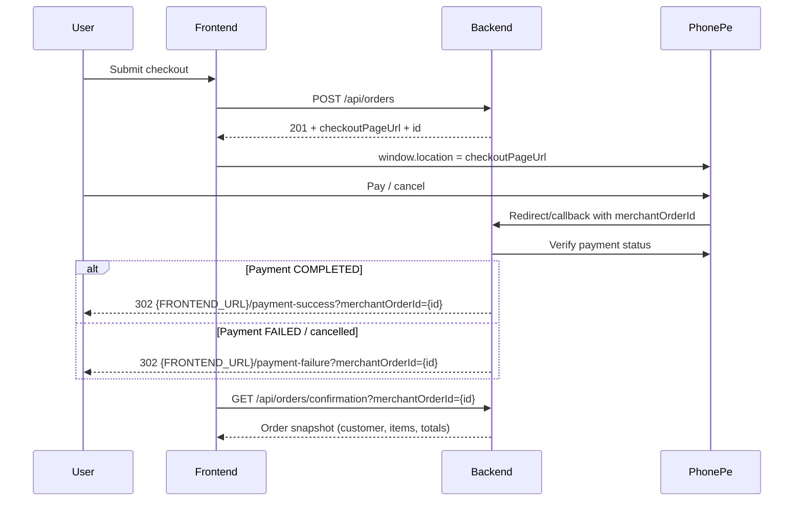

# Payment Confirmation & PhonePe Redirect Schema

**Audience:** Backend team  
**Status:** Frontend ready (Aug 2026)  
**Payment provider:** PhonePe Standard Checkout  
**Related:** [FRONTEND_PAYMENT_INTEGRATION.md](./FRONTEND_PAYMENT_INTEGRATION.md), [ORDER_CHECKOUT_SCHEMA.md](./ORDER_CHECKOUT_SCHEMA.md), [DISTRICT_ADDRESS_SCHEMA.md](./DISTRICT_ADDRESS_SCHEMA.md), [PAYMENT_RETRY_SCHEMA.md](./PAYMENT_RETRY_SCHEMA.md)

---

## Why this doc exists

1. After PhonePe payment, users must land on frontend:
   - Success → `/payment-success?merchantOrderId=...`
   - Failure → `/payment-failure?merchantOrderId=...`
2. Success page must show **Order Confirmed** with order id, items, totals, and delivery address from the **backend** (not from local cart).
3. Redirects are currently unreliable in some environments — usually `FRONTEND_URL` / callback / SPA hosting config.

Frontend already calls:

```http
GET /api/orders/confirmation?merchantOrderId={id}
```

Please implement this endpoint and fix redirect configuration as below.

---

## End-to-end flow (required)



---

## 1. Fix redirect URLs (highest priority)

### Required env / config

| Key | Example | Notes |
|-----|---------|-------|
| `FRONTEND_URL` | `https://nimmaashwini.com` | **No trailing slash** |
| PhonePe callback / redirect URL | `{API_BASE}/api/orders/check-status` | Must be HTTPS in prod |
| Success redirect | `{FRONTEND_URL}/payment-success?merchantOrderId={orderId}` | Exact path |
| Failure redirect | `{FRONTEND_URL}/payment-failure?merchantOrderId={orderId}` | Exact path |

`orderId` / `merchantOrderId` = Mongo order `_id` used when creating the PhonePe merchant order (same as `data.id` from `POST /api/orders`).

### Redirect rules

```http
HTTP/1.1 302 Found
Location: https://nimmaashwini.com/payment-success?merchantOrderId=6a476abc123def4567890123
```

Failure example:

```http
HTTP/1.1 302 Found
Location: https://nimmaashwini.com/payment-failure?merchantOrderId=6a476abc123def4567890123
```

### Common redirect bugs

| Bug | Symptom | Fix |
|-----|---------|-----|
| `FRONTEND_URL` wrong / localhost in prod | User stuck on API domain or 404 | Set production frontend origin |
| Trailing slash mismatch | `https://site.com//payment-success` | Strip trailing slash when joining |
| Missing query param | Success page has no order id | Always append `merchantOrderId` |
| Wrong param name only | Frontend may miss id | Prefer `merchantOrderId` (frontend also accepts `orderId`, `id`) |
| PhonePe redirect URL not registered | Callback never hits backend | Register exact callback in PhonePe dashboard |
| SPA hosting without rewrite | `/payment-success` returns S3/CloudFront 404 | Add SPA fallback to `index.html` for all non-file routes |
| Using `301` permanently | Hard to change later | Use `302` |

### Local / staging checklist

| Env | `FRONTEND_URL` example |
|-----|------------------------|
| Local FE | `http://localhost:5173` |
| Staging | `https://staging.nimmaashwini.com` |
| Production | `https://nimmaashwini.com` (or `https://www.nimmaashwini.com` — pick **one** canonical host) |

If production uses `www`, never redirect to apex (or vice versa) unless both are configured.

---

## 2. PhonePe merchant order id mapping

| Concept | Value |
|---------|--------|
| PhonePe `merchantOrderId` | Our order MongoDB `_id` (`data.id`) |
| Human-facing order number | `orderNumber` e.g. `NA-2026-00042` |
| Shown on success UI | Prefer `orderNumber`; always keep `merchantOrderId` as technical reference |

Do **not** invent a second id for PhonePe unless you also store the mapping and return both in confirmation API.

---

## 3. New public API — order confirmation

### `GET /api/orders/confirmation?merchantOrderId={id}`

**Auth:** None (guest checkout).  
**Purpose:** Power `/payment-success` and optionally enrich `/payment-failure`.

### Query

| Param | Required | Description |
|-------|----------|-------------|
| `merchantOrderId` | Yes | Order `_id` |

Also accept aliases if easy: `orderId`, `id` (frontend sends `merchantOrderId`).

### Security rules (important)

This is a public endpoint — return a **safe confirmation snapshot** only:

- Allow read when `paymentStatus` is `COMPLETED` **or** `FAILED` / `initiated` / `pending` (failure page may still load).
- Do **not** require auth.
- Do **not** expose internal PhonePe secrets, raw webhook payloads with credentials, admin notes, or other customers’ data.
- Optional hardening: rate-limit by IP; only return orders created in last N days.

### Success response — `200`

```json
{
  "success": true,
  "message": "Order confirmation",
  "data": {
    "id": "6a476abc123def4567890123",
    "orderNumber": "NA-2026-00042",
    "status": "confirmed",
    "paymentStatus": "COMPLETED",
    "orderType": "domestic",
    "currency": "INR",
    "customer": {
      "name": "Priya Sharma",
      "contactNumber": "+91 98765 43210",
      "alternateNumber": "",
      "address": "42, Temple Road, Jayanagar 4th Block",
      "landmark": "Near Nimma Ashwini Store",
      "pincode": "560041",
      "city": "Rajarajeshwari Nagar",
      "district": "Bengaluru",
      "state": "Karnataka",
      "country": "India"
    },
    "items": [
      {
        "productId": "6a475c66b203bc97e100aaa1",
        "slug": "herbal-hair-oil",
        "name": "Herbal Hair Oil",
        "variantId": "250ml",
        "variantLabel": "250 ml",
        "quantity": 1,
        "unitPrice": 750,
        "lineTotal": 750
      }
    ],
    "subtotal": 750,
    "taxableAmount": 714.29,
    "taxAmount": 35.71,
    "taxType": "cgst_sgst",
    "cgstAmount": 17.86,
    "sgstAmount": 17.85,
    "igstAmount": 0,
    "totalAmount": 750,
    "paidAt": "2026-08-20T12:05:10.000Z",
    "createdAt": "2026-08-20T12:04:01.000Z",
    "updatedAt": "2026-08-20T12:05:10.000Z",
    "paymentResult": {
      "status": "COMPLETED",
      "paymentDate": "2026-08-20T12:05:10.000Z",
      "transactionId": "PHONEPE_TXN_OPTIONAL"
    }
  }
}
```

### Field requirements for success UI

| Field | Required for UI | Notes |
|-------|-----------------|-------|
| `id` | Yes | Same as `merchantOrderId` |
| `orderNumber` | Strongly preferred | Shown as primary Order ID |
| `paymentStatus` | Yes | `COMPLETED` on success page |
| `status` | Yes | `confirmed` after paid |
| `customer.*` | Yes | Full shipping snapshot incl. **`district`** |
| `items[]` | Yes | name, qty, variantLabel, unitPrice/lineTotal |
| `subtotal` / `totalAmount` | Yes | Amount paid |
| `taxAmount` | Optional | Shown as GST included if present |
| `paidAt` | Optional | Fallback to `updatedAt` / `createdAt` |
| `paymentResult.transactionId` | Optional | Useful for support |

### Error responses

| HTTP | When |
|------|------|
| `400` | Missing `merchantOrderId` |
| `404` | Order not found |
| `200` with failed payment fields | Prefer this for failure page instead of 404 when order exists but unpaid |

**Example — not found:**

```json
{
  "success": false,
  "message": "Order not found"
}
```

---

## 4. Order document fields after PhonePe verify

On successful PhonePe verification, update:

```js
{
  status: "confirmed",
  paymentStatus: "COMPLETED",
  paidAt: new Date(),
  paymentResult: {
    status: "COMPLETED",
    paymentDate: new Date(),
    transactionId: "...", // from PhonePe if available
    raw: { /* optional trimmed PhonePe response */ }
  }
}
```

On failure / cancel:

```js
{
  status: "pending",          // or "cancelled" if you prefer
  paymentStatus: "FAILED",
  paymentResult: {
    status: "FAILED",
    paymentDate: new Date(),
    transactionId: "..."
  }
}
```

Do **not** mark stock as permanently consumed until payment is `COMPLETED` (or follow your existing stock reservation rules consistently).

---

## 5. Callback endpoint (existing)

### `GET /api/orders/check-status?merchantOrderId={id}`

PhonePe redirects the **browser** here after payment.

Backend must:

1. Read `merchantOrderId`
2. Call PhonePe status API
3. Persist order/payment status
4. **302 redirect** to frontend success or failure URL with the same id

Pseudo:

```js
const orderId = query.merchantOrderId;
const phonePeStatus = await phonePe.getStatus(orderId);

if (isPaid(phonePeStatus)) {
  await markOrderPaid(orderId, phonePeStatus);
  return redirect(302, `${FRONTEND_URL}/payment-success?merchantOrderId=${orderId}`);
}

await markOrderFailed(orderId, phonePeStatus);
return redirect(302, `${FRONTEND_URL}/payment-failure?merchantOrderId=${orderId}`);
```

---

## 6. Frontend behaviour (already implemented)

| Page | Behaviour |
|------|-----------|
| `/payment-success` | Clears cart; reads `merchantOrderId` (and aliases); calls confirmation API; shows order number, items, address, totals, discount |
| `/payment-failure` | Keeps cart; shows reference; tries confirmation API for status; **Try Again** → `POST /api/orders/retry-payment` → PhonePe (see [PAYMENT_RETRY_SCHEMA.md](./PAYMENT_RETRY_SCHEMA.md)); WhatsApp support link |
| Checkout | `POST /api/orders` → `window.location.assign(checkoutPageUrl)` |

Query params accepted by FE:

- `merchantOrderId` (preferred)
- `merchant_order_id`
- `orderId` / `order_id`
- `id`

---

## 7. Hosting dependency (frontend deploy)

Deep links must not 404:

- `/payment-success`
- `/payment-failure`

For S3 + CloudFront / static hosting, add SPA rewrite:

- All routes → `/index.html` (except static assets / API)

Without this, PhonePe redirect “fails” even when backend Location header is correct.

---

## 8. Backend checklist

- [ ] `FRONTEND_URL` correct per environment (no trailing slash)
- [ ] PhonePe callback URL registered and hits `GET /api/orders/check-status`
- [ ] Callback verifies with PhonePe, then **302** to FE success/failure with `merchantOrderId`
- [ ] Implement `GET /api/orders/confirmation?merchantOrderId=`
- [ ] Implement `POST /api/orders/retry-payment` (same order, new `checkoutPageUrl`) — [PAYMENT_RETRY_SCHEMA.md](./PAYMENT_RETRY_SCHEMA.md)
- [ ] Confirmation payload includes customer (with `district`), items, totals, `orderNumber`
- [ ] Paid orders set `status=confirmed`, `paymentStatus=COMPLETED`
- [ ] Smoke test: pay in UAT → land on FE success → details render from API
- [ ] Smoke test: cancel payment → land on FE failure with same reference

---

## 9. Smoke test commands

```bash
# After a real/UAT payment, replace ORDER_ID
curl -s "$API_BASE/api/orders/confirmation?merchantOrderId=ORDER_ID" | jq

# Expect success:true and data.customer + data.items
```

Manual browser checks:

1. Complete PhonePe UAT payment  
2. URL becomes `https://<frontend>/payment-success?merchantOrderId=...`  
3. Page shows **Order Confirmed**, order number, address, line items, total  
4. Cart is empty afterward  
5. Failed/cancelled payment lands on `/payment-failure?...` and cart still has items  

---

## Contact / ownership

| Area | Owner |
|------|--------|
| PhonePe dashboard redirect URLs + keys | Backend |
| `FRONTEND_URL` + callback 302 | Backend |
| Confirmation API schema | Backend |
| Success / failure UI | Frontend (done) |
| SPA rewrite for deep links | Frontend / DevOps |

If success page shows only a reference id and an error loading details, confirmation API is missing or returning non-200 — not a PhonePe UI issue.
